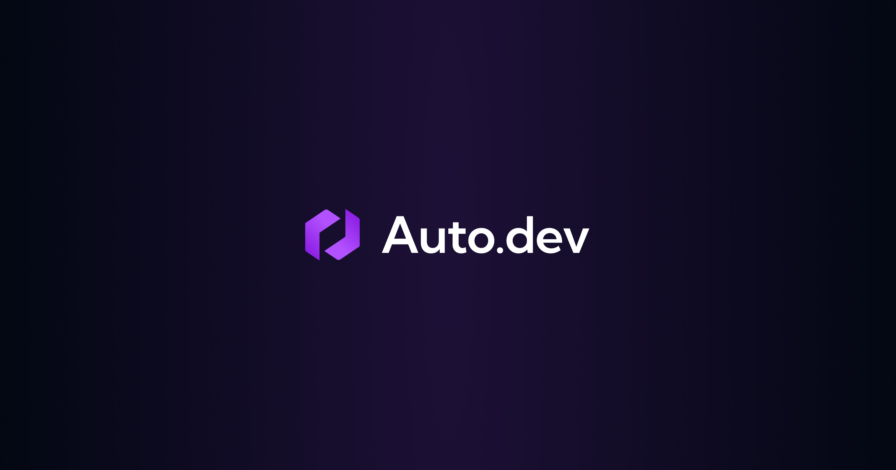

<h1 align="center">Auto.dev Agent Skill</h1>

<p align="center">
  
</p>

<p align="center">
  Give any AI coding agent superpowers with <a href="https://auto.dev">Auto.dev</a> automotive data APIs. Search vehicle listings, decode VINs, calculate payments, check recalls, and more — all through natural conversation.
</p>

Works with **Claude Code**, **Cursor**, **Codex**, **GitHub Copilot**, **Windsurf**, and [40+ other agents](https://github.com/vercel-labs/skills#supported-agents).

## Install

```bash
npx skills add drivly/auto-dev-skill
```

That's it. One command. The [skills CLI](https://github.com/vercel-labs/skills) handles installation for your agent automatically.

### Options

```bash
# Install globally (available across all projects)
npx skills add drivly/auto-dev-skill -g

# Install to a specific agent
npx skills add drivly/auto-dev-skill -a claude-code

# Install to multiple agents
npx skills add drivly/auto-dev-skill -a claude-code -a cursor -a codex

# Non-interactive (CI/CD friendly)
npx skills add drivly/auto-dev-skill -g -a claude-code -y
```

### Set Your API Key

Sign up at [auto.dev](https://auto.dev) and get your API key from the [dashboard](https://auto.dev/dashboard).

```bash
export AUTODEV_API_KEY="sk_ad_your_key_here"
```

Add this to your shell profile (`~/.zshrc`, `~/.bashrc`) to persist it. Or just paste your key when your agent asks — it works either way.

## What It Does

Instead of reading API docs and crafting curl commands, just describe what you need:

- **"Find all Toyota RAV4s under $30k near Miami"** — searches listings with the right filters
- **"Decode this VIN: JM3KKAHD5T1379650"** — calls VIN decode, returns structured data
- **"Compare these two cars side by side"** — chains specs, payments, and TCO endpoints in parallel
- **"Export all Honda Civics in Texas to CSV"** — paginates through results and saves to file
- **"What's the monthly payment on this car with $10k down?"** — calculates financing with real rates
- **"Check if this car has any open recalls"** — safety check before you buy
- **"Build me a car search app with Next.js"** — scaffolds a full project wired to Auto.dev APIs

The skill handles authentication, pagination, error handling, cost estimation, and output formatting automatically.

## Supported APIs

### V2 APIs (Primary)

| Endpoint | Plan | Description |
|----------|------|-------------|
| Vehicle Listings | Starter | Search millions of active listings |
| VIN Decode | Starter | Decode any VIN to vehicle data |
| Vehicle Photos | Starter | High-quality vehicle images |
| Specifications | Growth | Full technical specs and features |
| OEM Build Data | Growth | Factory options, colors, MSRP |
| Vehicle Recalls | Growth | NHTSA recall history |
| Total Cost of Ownership | Growth | 5-year ownership cost analysis |
| Vehicle Payments | Growth | Loan payment calculator |
| Interest Rates | Growth | APR by credit score and term |
| Open Recalls | Scale | Unresolved recalls only |
| Plate-to-VIN | Scale | License plate lookup |
| Taxes & Fees | Scale | State/local tax calculations |

### V1 APIs (Supplemental — No V2 Equivalent)

| Endpoint | Description |
|----------|-------------|
| Models | List all makes/models in database |
| Cities | US city data by state |
| ZIP Lookup | ZIP to coordinates/DMA |
| Autosuggest | Type-ahead for makes/models |

## Pricing

| Plan | Monthly | Annual | Rate Limit | What You Get |
|------|---------|--------|------------|--------------|
| **Starter** | Free + data fees | — | 5 req/s | VIN Decode, Listings, Photos (1,000 free calls/mo) |
| **Growth** | $299/mo + data fees | $249/mo | 10 req/s | + Specs, Recalls, TCO, Payments, APR, Build |
| **Scale** | $599/mo + data fees | $499/mo | 50 req/s | + Open Recalls, Plate-to-VIN, Taxes & Fees |

All plans charge per-call data fees on every request. Growth and Scale have no cap on call volume — requests are never throttled or blocked — but data fees still apply. See [auto.dev/pricing](https://www.auto.dev/pricing) for per-call costs.

If you hit an endpoint outside your plan, your agent will let you know what's needed and link you directly to upgrade.

## Examples

**Search and export:**
> "Find all Mazda CX-90s under $60k in Florida and save to CSV"

**Full vehicle report:**
> "Tell me everything about VIN WP0AA2A92PS206106"

**Payment comparison:**
> "Find SUVs under $40k near 33132 and show monthly payments with $5k down"

**Market analysis:**
> "What's the going rate for a 2023 BMW X5?"

**Build a complete app:**
> "Build me a used car search app with Next.js"

**Dealer competitive analysis:**
> "Compare pricing across Toyota dealers within 50 miles of Orlando"

**Interactive exploration:**
> "Show me SUVs under $50k in FL" → "Only AWD" → "Any recalls?" → "Payments on top 5?"

## Skill Contents

| File | Purpose |
|------|---------|
| `SKILL.md` | Entry point: auth, quick reference, plan summary |
| `pricing.md` | Full per-call costs, plan tiers, upgrade links |
| `examples.md` | Real API responses and agent output examples |
| `v2-listings-api.md` | V2 Listings: filters, pagination, response schema |
| `v2-vin-apis.md` | V2 VIN-based: decode, specs, build, photos, recalls, payments, APR, taxes, TCO |
| `v2-plate-api.md` | V2 Plate-to-VIN reference |
| `v1-apis.md` | V1 supplemental: models, cities, ZIP, autosuggest |
| `chaining-patterns.md` | Multi-endpoint composition workflows |
| `code-patterns.md` | Framework code gen (Next.js, React, Express, Flask, Python) |
| `error-recovery.md` | Input validation, model name normalization, error handling |
| `interactive-explorer.md` | Conversational search refinement across messages |
| `integration-recipes.md` | Slack, email, cron, Zapier, Google Sheets integrations |
| `business-workflows.md` | Dealer analysis, market pricing, fleet procurement, due diligence |
| `app-scaffolding.md` | Full app templates: car search, dealer dashboard, VIN lookup |

## Manage Your Skill

```bash
# Check for updates
npx skills check

# Update to latest version
npx skills update

# Remove the skill
npx skills remove auto-dev
```

## Documentation

- [Auto.dev API Docs](https://docs.auto.dev/)
- [Auto.dev Pricing](https://www.auto.dev/pricing)
- [Auto.dev Dashboard](https://auto.dev/dashboard)
- [Skills CLI](https://github.com/vercel-labs/skills)
- [Skills Directory](https://skills.sh)

## License

MIT — see [LICENSE](LICENSE) for details.
